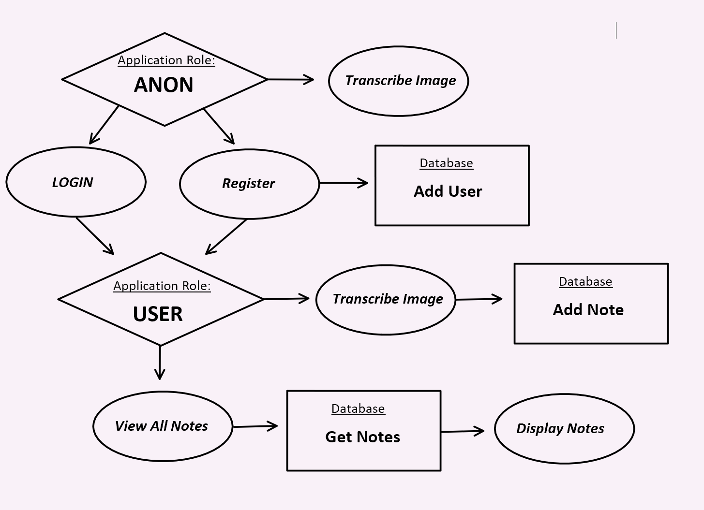
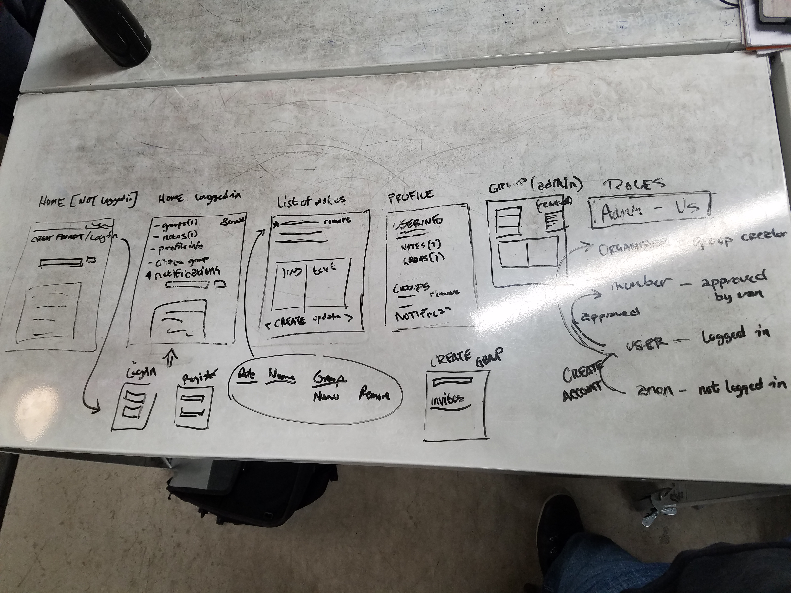
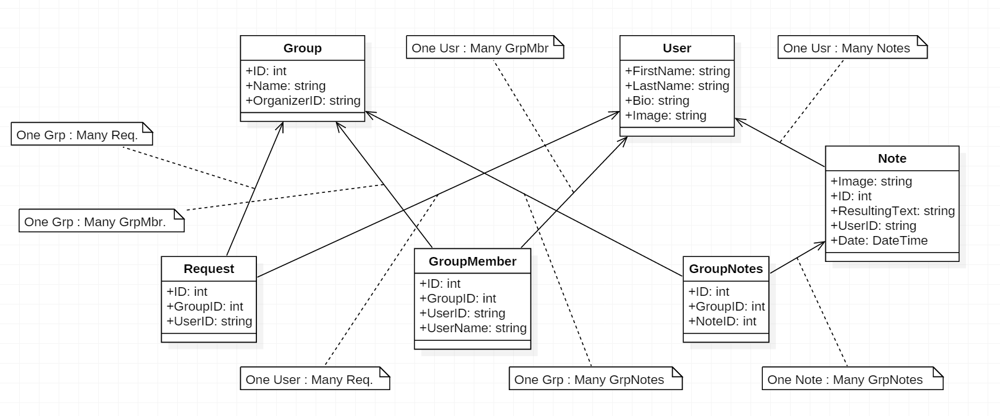

# Introduction 
 Handwritting is still very useful in today's technology centric life style. Give syou the freedom to write where you want
on a page and easily switch where on the page you want your next thought to go, and there'sthe benifit of the muscle memory you gain
from writing the characters vs just clicking buttons. But paper documents can get cluttered, take up real space, and be frustrating to organize.
 Wordify is an application designed to help users convert handwritten documents, be it class notes, 
old family recipes, you name it. With this app you can take a photo of your document and scan it with our app to product machine readable text.
You can edit and adjust it as you see fit, and save the image and text into our database where it is easily organized and referencable for the users convenience. 

## Data Flow 
  

## Wireframe
  

## Database Schema
  

## Happy Path

Have a jpg, png or bmp file saved on your computer. Hit the "Browse" button and select the image you want, then hit "Upload."
You will see your image and what the OCR was able to decipher off of it in an area that you can edit. From there, if you are using 
the site anonymously you can copy + paste the text area and save it onto your own document. If you are logged in, you can then title it and 
save it into our database. From the Profile page you can view, edit, or delete all images you have uploaded as you see fit. 

## Technologies used
Microsoft Cognitive Services OCR(Optical Character Reader) Handwriting Mode, Visual Studio, VSTS, Azure, Azure Blob Storage, Microsoft Identity Framework

C#, HTML5, CSS3, Razor Pages, SQL 

# Contributions
Assistence from the Instructional Staff of Code Fellows, as well as Microsoft Docs

